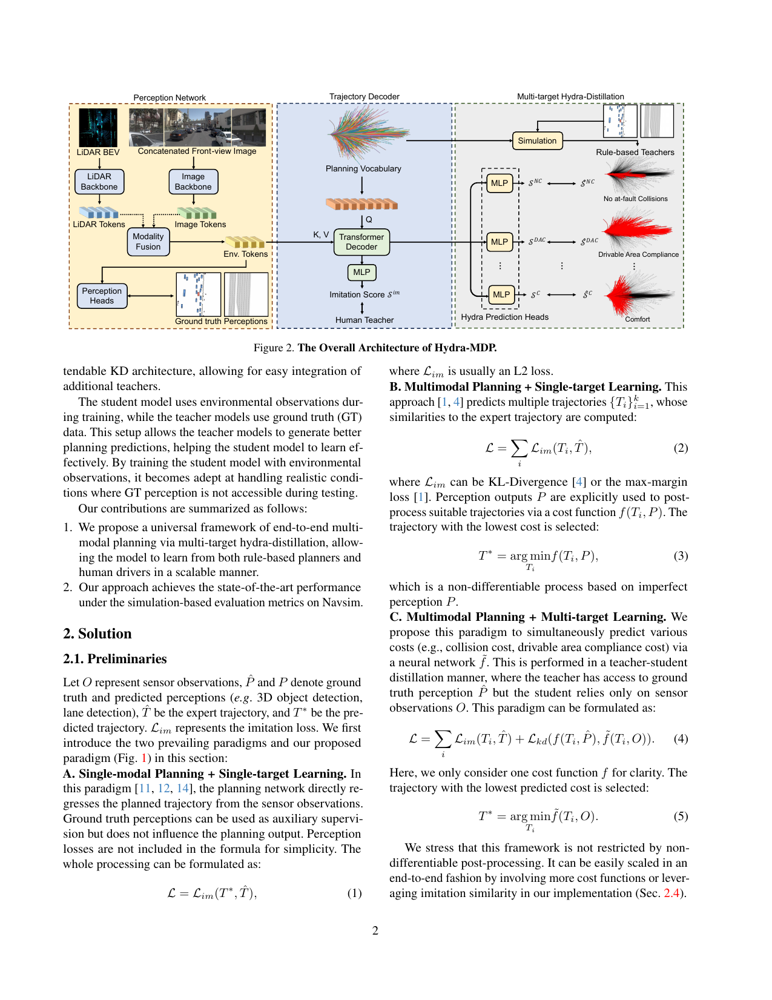

# Hydra-MDP：论文分析

> 来源：用户提供的 PDF《Hydra-MDP: End-to-end Multimodal Planning with Multi-target Hydra-Distillation》  
> 论文 arXiv 标识：arXiv:2406.06978v4，2024 年 8 月 30 日  
> 作者：Zhenxin Li、Kailin Li、Shihao Wang、Shiyi Lan、Zhiding Yu、Yishen Ji、Zhiqi Li、Ziyue Zhu、Jan Kautz、Zuxuan Wu、Yu-Gang Jiang、Jose M. Alvarez  
> 机构：NVIDIA、复旦大学、华东师范大学、北京理工大学、南京大学、南开大学  
> 代码：[github.com/NVlabs/Hydra-MDP](https://github.com/NVlabs/Hydra-MDP)

## 一、论文基础信息速览

| 项目 | 内容 |
|---|---|
| 标题 | **Hydra-MDP: End-to-end Multimodal Planning with Multi-target Hydra-Distillation** |
| 中文理解 | Hydra-MDP：基于多目标 Hydra 蒸馏的端到端多模态规划 |
| 研究方向 | 端到端自动驾驶、多模态轨迹规划、知识蒸馏、闭环评估 |
| 核心问题 | 单一人类模仿目标无法覆盖多种闭环评价标准和驾驶行为 |
| 核心方法 | 使用人类教师与规则教师进行多目标知识蒸馏 |
| 学生模型 | 感知网络 + 多头轨迹解码器 + 多目标预测头 |
| 规划表示 | 固定轨迹 vocabulary，由 nuPlan 轨迹 K-means 聚类得到 |
| 输入 | 前视摄像头图像、LiDAR BEV、传感器环境特征 |
| 评测 | NAVSIM navtest 闭环指标 |
| 最佳结果 | Hydra-MDP-V8192-W-EP：Score 86.5；扩大模型并集成后最高 91.0 |
| 关键特点 | 训练阶段用 GT perception 和仿真教师，推理阶段只使用传感器输入 |
| 论文类型 | 方法论文、自动驾驶系统研究 |

## 二、极简全文核心总结

Hydra-MDP 认为端到端自动驾驶规划不是单一目标问题，而是同时需要模仿人类行为、避免碰撞、遵守可行驶区域、保持舒适性并提高行驶进度。论文构建多目标 teacher-student 蒸馏框架：学生网络从传感器输入生成多条候选轨迹，并分别学习人类 imitation score 与规则仿真指标，推理时将多种子分数加权为统一代价选择轨迹。该方法在 NAVSIM 上显著优于单目标模仿和非可微后处理基线。

## 三、研究背景与研究意义

### 3.1 端到端规划的目标不止一个

传统端到端自动驾驶通常学习：

$$
\text{传感器观测}\rightarrow\text{人类专家轨迹}
$$

但闭环驾驶评价还关心：

- No-at-fault Collisions（NC）：无责任碰撞；
- Drivable Area Compliance（DAC）：可行驶区域合规；
- Time to Collision（TTC）：碰撞时间裕度；
- Comfort（C）：舒适性；
- Ego Progress（EP）：自车行驶进度；
- DDC：驾驶方向合规等。

单条人类 log-replay 轨迹并不能完整表达这些评价标准。

### 3.2 单模态、单目标学习的局限

单模态规划器直接回归一条轨迹：

$$
\mathcal{L}=\mathcal{L}_{im}(T^*,\hat T)
$$

其中 $\hat T$ 是人类专家轨迹，$T^*$ 是模型预测轨迹。

问题：

- 每个场景通常只有一条专家轨迹；
- 其他同样可行的驾驶方案没有监督；
- 人类行为不一定是闭环评价下的最优行为；
- 训练目标与碰撞、舒适性、进度等指标存在错位。

### 3.3 多模态但单目标学习的局限

已有方法可以生成多条候选轨迹，再根据感知结果进行后处理选择：

$$
T^*=\arg\min_{T_i}f(T_i,P)
$$

其中 $P$ 是预测感知结果，$f$ 是规则代价函数。

这种方案的问题是：

- 后处理不可微；
- 依赖不完美的预测感知；
- 感知和规划之间存在信息损失；
- 规划网络没有真正学习规则指标与环境之间的关系。

### 3.4 Hydra-MDP 的核心观点

论文将端到端规划重新定义为：

$$
\text{多模态规划}
+
\text{多目标学习}
$$

学生模型不只模仿人类，还从规则型教师中学习闭环指标，使规则知识进入神经网络，而不是留在不可微的后处理模块中。

## 四、核心方法、模型、公式与流程

### 4.1 论文方案整体框架图

论文 Figure 2 展示 Hydra-MDP 的整体架构。PDF 中的原始框架图已导出到 Obsidian vault：



> **图 2：Hydra-MDP 整体架构。** 左侧感知网络接收 LiDAR BEV 和拼接的前视图像，输出环境 token；中间轨迹解码器基于固定 planning vocabulary 生成候选轨迹和 imitation score；右侧多目标 Hydra-distillation 头分别学习仿真规则教师产生的 NC、DAC、C、TTC、EP 等子指标，推理时将这些分数组合成最终代价并选择轨迹。图片来自用户提供的论文 PDF 第 2 页。

整体因果链：

```text
LiDAR + Camera
      ↓
多模态感知网络
      ↓
环境 token F_env
      ↓
固定 planning vocabulary
      ↓
Trajectory Decoder 生成多条候选轨迹
      ├─ imitation score
      └─ 多个 Hydra prediction heads
            ├─ NC
            ├─ DAC
            ├─ TTC
            ├─ Comfort
            └─ EP
      ↓
训练：人类教师 + 规则仿真教师的多目标蒸馏
      ↓
推理：加权组合各子分数为统一代价
      ↓
选择最低代价轨迹
```

### 4.2 三种规划范式

#### A. 单模态规划 + 单目标学习

模型直接从传感器观测预测一条轨迹：

$$
\mathcal{L}=\mathcal{L}_{im}(T^*,\hat T)
$$

感知分支可以有辅助监督，但不直接影响规划目标。

#### B. 多模态规划 + 单目标学习

模型预测 $k$ 条候选轨迹：

$$
\{T_i\}_{i=1}^{k}
$$

使用 imitation loss 训练候选轨迹接近专家轨迹，并通过后处理代价函数选择：

$$
T^*=\arg\min_{T_i}f(T_i,P)
$$

#### C. 多模态规划 + 多目标学习

Hydra-MDP 同时预测多种代价：

$$
\mathcal{L}
=
\sum_i \mathcal{L}_{im}(T_i,\hat T)
+
\mathcal{L}_{kd}(f(T_i,\hat P),\tilde f(T_i,O))
$$

其中：

- $\hat P$：GT perception；
- $O$：学生可用的传感器观测；
- $f$：规则教师或仿真器产生的目标；
- $\tilde f$：学生网络预测的代价；
- $\mathcal{L}_{kd}$：知识蒸馏损失。

## 4.3 感知网络

感知网络基于 Transfuser，包含：

- Image backbone；
- LiDAR backbone；
- 多模态 Transformer fusion；
- 3D object detection heads；
- BEV segmentation heads。

输入：

- LiDAR 点云；
- 拼接后的前视、前左、前右图像；
- LiDAR BEV 表示。

输出环境 token：

$$
F_{env}
$$

该 token 汇总图像和 LiDAR 中的场景语义，供轨迹解码器使用。

训练时教师可以使用 GT perception，但学生推理只使用传感器输入。这种 teacher-student 设置使教师拥有更准确的环境信息，而学生学习在现实测试条件下工作。

### 4.4 固定 Planning Vocabulary

连续轨迹空间首先从 nuPlan 数据库中随机采样约 700K 条轨迹。每条轨迹包含 40 个时间点：

$$
T_i=\{(x_n,y_n,h_n)\}_{n=1}^{40}
$$

对应：

- 10 Hz 采样频率；
- 4 秒规划时域；
- 位置 $(x_n,y_n)$；
- 航向角 $h_n$。

之后使用 K-means 聚类得到固定轨迹 vocabulary：

$$
V_k=\{T_i\}_{i=1}^{k}
$$

每条 vocabulary trajectory 被嵌入为一个 latent query。这样将连续动作空间转换为有限候选集合。

### 4.5 Trajectory Decoder

轨迹 vocabulary 经过 MLP 后作为 Transformer query，并与自车状态融合：

$$
V'_k=\operatorname{Transformer}(Q,K,V=\operatorname{MLP}(V_k))+E
$$

其中 $E$ 是 ego status。

随后使用环境 token 进行 cross-attention：

$$
V''_k
=
\operatorname{Transformer}
(Q=V'_k,K,V=F_{env})
$$

最终，每个候选轨迹对应：

- 一条轨迹预测；
- 一个 imitation score；
- 多个闭环指标子分数。

### 4.6 人类教师：Imitation Score

将 log-replay 专家轨迹 $\hat T$ 与 planning vocabulary 中的候选轨迹进行 L2 距离比较：

$$
 y_i
=
\frac{\exp(-\|\hat T-T_i\|_2^2)}
{\sum_{j=1}^{k}\exp(-\|\hat T-T_j\|_2^2)}
$$

$y_i$ 是对第 $i$ 条轨迹的 imitation target。

训练损失为：

$$
\mathcal{L}_{im}
=-\sum_{i=1}^{k}y_i\log S_i^{im}
$$

其中 $S_i^{im}$ 是轨迹 $i$ 的 softmax imitation score。

这不是只选择距离最近的单条轨迹，而是使用 soft target，让多个接近专家轨迹的候选都获得一定监督。

### 4.7 规则教师：Multi-target Hydra-Distillation

#### 4.7.1 离线仿真标注

对训练集中的每个场景，将 planning vocabulary 中的所有候选轨迹送入离线仿真器，得到多个指标的模拟分数：

$$
\{\hat S_{im},\hat S_{NC},\hat S_{DAC},\hat S_{TTC},\hat S_C,\hat S_{EP}\}
$$

其中：

- $NC$：无责任碰撞；
- $DAC$：可行驶区域合规；
- $TTC$：碰撞时间；
- $C$：舒适性；
- $EP$：自车行驶进度。

论文中还讨论 DDC，但由于实现问题，主要蒸馏和结果表使用 NC、DAC、TTC、C、EP。

#### 4.7.2 多头预测

对每条候选轨迹的 latent vector，使用多个 Hydra Prediction Heads 分别预测各子指标：

$$
\{S_i^m\}_{m\in\mathcal{M}}
$$

每个 head 学习一个闭环指标，而不是把所有指标提前压缩成单一分数。

#### 4.7.3 蒸馏损失

论文使用 binary cross-entropy：

$$
\mathcal{L}_{kd}
=
-
\sum_{m,i}
\left[
\hat S_i^m\log S_i^m
+
(1-\hat S_i^m)\log(1-S_i^m)
\right]
$$

其中：

- $\hat S_i^m$：仿真教师标签；
- $S_i^m$：学生网络预测；
- $m$：具体指标；
- $i$：候选轨迹。

多目标的关键不是训练多个独立系统，而是让同一个学生模型通过多个预测头同时吸收不同教师知识。

### 4.8 推理时的轨迹选择

推理时不再运行不可微仿真器，而是将学生网络预测的多个子分数组合为统一代价：

$$
\tilde f(T_i,O)
=
-
\left(
 w_1\log S_i^{im}
+w_2\log S_i^{NC}
+w_3\log S_i^{DAC}
+w_4\log
\left(
5S_i^{TTC}+2S_i^C+5S_i^{EP}
\right)
\right)
$$

最终选择最低代价轨迹：

$$
T^*=\arg\min_{T_i}\tilde f(T_i,O)
$$

权重 $w_i$ 通过 grid search 得到。论文给出的典型范围：

- $0.01\le w_1\le0.1$；
- $0.1\le w_2,w_3\le1$；
- $1\le w_4\le10$。

这表明规则型安全和闭环指标通常比纯 imitation score 更重要。

### 4.9 模型集成

论文使用两种集成方式：

1. **Mixture of Encoders**：用线性层融合不同视觉 encoder 的特征；
2. **Sub-score Ensembling**：对多个模型的指标子分数进行加权融合，再选择轨迹。

最终较强模型的结果来自多个 backbone 和预训练模型的集成。

## 五、核心创新点与传统方法对比

### 5.1 从单一目标变为多目标蒸馏

传统 imitation learning 主要回答：

> 哪条轨迹像人类？

Hydra-MDP 同时回答：

- 哪条轨迹像人类？
- 哪条轨迹不容易碰撞？
- 哪条轨迹留在可行驶区域？
- 哪条轨迹更舒适？
- 哪条轨迹能获得更高行驶进度？

### 5.2 从后处理规则变为网络内学习

传统流程：

```text
网络生成轨迹
    ↓
外部规则后处理
    ↓
选择轨迹
```

Hydra-MDP：

```text
离线仿真教师产生监督
    ↓
网络学习各类闭环代价
    ↓
推理时直接预测代价并选择
```

规则知识被蒸馏进网络，训练和推理流程更端到端。

### 5.3 多目标比单一总分更稳定

论文发现，直接蒸馏整体 PDM score 可能因为分数分布不规则而性能下降；分别蒸馏连续和离散子指标，可以保留更多结构化信息。

### 5.4 多模态 vocabulary 降低动作空间难度

通过 K-means 轨迹 vocabulary，模型不是直接回归任意连续轨迹，而是在有限候选空间中生成和评分轨迹。这有利于：

- 产生多种行为候选；
- 使用多个教师逐轨迹打分；
- 通过排序和选择实现规划。

### 5.5 方法对比

| 范式 | 多模态 | 多目标 | 规则是否可微进入网络 | 选择机制 |
|---|---:|---:|---:|---|
| 单模态 IL | 否 | 通常否 | 否 | 直接回归 |
| 多模态单目标 | 是 | 否 | 通常否 | 外部后处理 |
| Hydra-MDP | 是 | 是 | 是，通过蒸馏 | 网络预测代价 + 加权选择 |

## 六、理论分析与关键假设

### 6.1 方法的理论含义

Hydra-MDP 不是一个以概率最优性或收敛定理为核心的理论模型，而是一个多教师、多目标的监督学习和知识蒸馏框架。

其核心假设是：

$$
\text{复杂闭环目标}
\approx
\text{多个可学习的轨迹子目标}
$$

通过分别学习各个子目标，再在推理时组合，可以比直接学习一个总分更稳定。

### 6.2 关键假设

#### 轨迹 vocabulary 足够覆盖行为空间

若 K-means vocabulary 没有覆盖某类合理驾驶行为，学生只能在有限候选中选择，无法生成 vocabulary 之外的轨迹。

#### 离线仿真评分可靠

规则教师和仿真器被当作闭环指标的监督来源。仿真器误差、评分偏差或实现问题会直接进入学生模型。

#### 多个子指标具有互补性

方法假设 NC、DAC、TTC、C、EP 等子目标分开学习后，组合可以表达最终规划偏好。

#### 推理输入分布与训练教师设置可对齐

教师使用 GT perception，学生使用传感器输入。蒸馏有效的前提是学生能够从传感器中恢复足够的环境语义。

### 6.3 理论没有保证的内容

方法没有严格保证：

- 多目标分数加权后等价于真实闭环最优；
- 轨迹选择一定在真实环境中安全；
- 规则教师的知识能够完整迁移；
- vocabulary 外的最优轨迹不会重要；
- grid search 得到的权重在不同场景和数据集上都最优。

### 6.4 训练目标与最终评价之间的差距

训练主要是逐轨迹 BCE 蒸馏和 imitation learning，最终评价是闭环仿真分数。因此：

$$
\text{逐候选轨迹预测准确}
\not\Rightarrow
\text{最终闭环控制一定最优}
$$

误差可能来自：

- 评分预测误差；
- 多个分数加权误差；
- 轨迹之间排序不稳定；
- 闭环执行与离线单场景评分不一致。

## 七、实验设计与结果分析

### 7.1 数据集与指标

论文使用 NAVSIM 的 Navtrain 和 Navtest：

- Navtrain：1192 个场景；
- Navtest：136 个场景。

数据来自 OpenScene/nuPlan 的规划场景，包含：

- 360°摄像头传感器信息；
- LiDAR 点云；
- 2D HD map；
- 3D object bounding boxes；
- 需要处理意图变化的交通场景。

PDM score：

$$
PDMscore
=
NC\times DAC\times
\frac{5\times TTC+2\times C+5\times EP}{12}
$$

论文注明由于实现问题，蒸馏和结果中忽略 DDC。

### 7.2 主要实现设置

- 8 张 NVIDIA A100；
- 总 batch size 256；
- 训练 20 epochs；
- 学习率 $1\times10^{-4}$；
- weight decay 0；
- LiDAR 使用 4 帧点云投影到 BEV；
- 默认图像输入分辨率为 $256\times1024$；
- 默认图像与 LiDAR backbone 使用 ResNet-34；
- 不使用额外 test-time augmentation。

### 7.3 NAVSIM 主结果

| 方法 | 输入 | NC | DAC | EP | TTC | C | Score |
|---|---|---:|---:|---:|---:|---:|---:|
| PDM-Closed | Perception GT | 94.6 | 99.8 | 89.9 | 86.9 | 99.9 | 89.1 |
| Transfuser | LiDAR & Camera | 96.5 | 87.9 | 73.9 | 90.2 | 100 | 78.0 |
| VADv2-V8192 | LiDAR & Camera | 97.2 | 89.1 | 76.0 | 91.6 | 100 | 80.9 |
| Hydra-MDP-V4096 | LiDAR & Camera | 97.7 | 91.5 | 77.5 | 92.7 | 100 | 82.6 |
| Hydra-MDP-V8192 | LiDAR & Camera | 97.9 | 91.7 | 77.6 | 92.9 | 100 | 83.0 |
| Hydra-MDP-V8192-W | LiDAR & Camera | 98.1 | 96.1 | 77.8 | 93.9 | 100 | 85.7 |
| Hydra-MDP-V8192-W-EP | LiDAR & Camera | 98.3 | 96.0 | 78.7 | 94.6 | 100 | **86.5** |

主要观察：

- vocabulary 从 4096 增加到 8192 后性能提升；
- 推理时使用 weighted confidence 后显著提升；
- 单独蒸馏整体 PDM score 的收益不稳定；
- 增加 EP 连续目标蒸馏后，EP 和总分进一步提升；
- Hydra-MDP-V8192-W-EP 相比 VADv2-V8192 的 Score 提升 5.6。

### 7.4 Scaling Up

| 模型 | Backbone / 分辨率 | NC | DAC | EP | TTC | C | Score |
|---|---|---:|---:|---:|---:|---:|---:|
| Hydra-MDP-A | ViT-L，256×1024 | 98.4 | 97.7 | 85.0 | 94.5 | 100 | 89.9 |
| Hydra-MDP-B | V2-99，512×2048 | 98.4 | 97.8 | 86.5 | 93.9 | 100 | 90.3 |
| Hydra-MDP-C | ViT-L + ViT-L + V2-99 | 98.7 | 98.2 | 86.5 | 95.0 | 100 | **91.0** |

Hydra-MDP-C 使用多个更大 backbone 和模型集成，达到 91.0 Score。

### 7.5 消融结论

#### Vocabulary 大小

$V_{8192}$ 优于 $V_{4096}$，说明更大的候选轨迹空间提供了更丰富的行为覆盖。

#### 非可微后处理

论文报告 post-processing 带来的性能提升小于 Hydra-MDP 网络内学习，支持将规则知识蒸馏进学生网络的设计。

#### Weighted confidence

不同教师的分数拟合质量不同，因此对各子分数赋予不同权重有助于抑制不可靠教师的影响。

#### 整体 PDM score 蒸馏

直接蒸馏整体 PDM score 受到其不规则分布影响，性能反而下降。这是论文支持“多目标拆分学习”的关键证据。

#### EP 蒸馏

EP 是连续指标，单独蒸馏 EP 后，Hydra-MDP-V8192-W-EP 的 EP 从 77.8 提升到 78.7，Score 从 85.7 提升到 86.5。

### 7.6 实验结论的边界

实验支持：

- 多目标蒸馏优于单一 imitation 目标；
- 规则知识进入网络后可以减少对后处理的依赖；
- 更大的 vocabulary 和模型集成有助于提高性能；
- 连续 EP 目标值得单独蒸馏。

实验不能完全证明：

- 多目标蒸馏在所有自动驾驶数据集上都优于单目标学习；
- 规则教师一定比人类教师更可靠；
- 后处理在真实部署中一定不需要；
- 91.0 Score 等价于真实道路安全性。

## 八、学术价值、局限性与潜在漏洞

### 8.1 学术价值

1. **提出多目标端到端规划范式。** 将规划从单一模仿任务改为多目标、多模态决策任务。
2. **融合人类与规则教师。** 人类教师提供行为先验，规则教师提供安全、合规、舒适和进度知识。
3. **减少不可微后处理依赖。** 将仿真指标转化为可学习的轨迹子分数。
4. **保留多模态候选。** 通过 planning vocabulary 生成多个行为选项。
5. **具有可扩展性。** 新增教师或指标时，可以增加对应 Hydra prediction head。

### 8.2 论文明确暴露的限制

- 规则教师依赖离线仿真，额外成本较高；
- PDM 评分实现中 DDC 被忽略；
- 多目标权重通过 grid search 获得；
- 模型集成和更大 backbone 对最终成绩贡献明显；
- planning vocabulary 是固定的，无法动态扩展。

### 8.3 分析者识别出的潜在问题

#### 问题一：离线仿真成本高

对整个训练集的每个场景、每条 vocabulary trajectory 运行仿真，计算量可能非常大。若 vocabulary 为 8192，候选数量与场景数相乘后成本显著。

#### 问题二：教师标签存在仿真偏差

规则教师的输出不是现实世界真值，而是由仿真规则和评分实现产生。学生可能学到 NAVSIM 评分器的偏好，而不是真实驾驶安全规律。

#### 问题三：固定 vocabulary 限制连续动作空间

K-means 聚类中心只是有限轨迹集合。若候选空间不覆盖某类更优轨迹，网络无法从候选集合外直接生成该轨迹。

#### 问题四：多目标权重需要搜索

推理代价中的 $w_i$ 通过 grid search 得到，说明系统存在额外的验证集调参成本。权重在不同数据分布、天气和交通场景中可能需要变化。

#### 问题五：多目标冲突没有完全解决

安全、舒适、进度和模仿可能互相冲突。加权对数分数是一种工程折中，并不是严格的 Pareto 最优或风险敏感优化。

#### 问题六：GT perception 与学生输入存在 teacher-student gap

教师使用 GT perception，学生只使用传感器预测特征。如果训练中没有充分模拟感知噪声，学生可能无法可靠复制教师排序。

#### 问题七：模型集成掩盖单模型能力

最终 91.0 的结果使用多个 backbone 和 sub-score ensemble。若关注方法本身，应同时报告统一 backbone、单模型和不集成条件下的结果。

#### 问题八：闭环指标并不等同于真实安全

NAVSIM 的闭环评分更接近仿真环境中的规划质量，不足以覆盖真实交通参与者反应、传感器故障、车辆动力学误差和极端分布外场景。

## 九、通俗讲解

### 9.1 传统方法像什么

传统自动驾驶模型像一个学生只跟着老司机的一条示范路线学习：

```text
老司机怎么开 → 模型尽量模仿
```

但现实中同一个路口可能有多种合理走法，而且评价系统还会关心：

- 会不会撞车；
- 有没有压出道路；
- 刹车是否平稳；
- 是否顺利通过场景。

单纯模仿老司机不能覆盖所有要求。

### 9.2 Hydra-MDP 像多个老师一起教

Hydra-MDP 找了多种老师：

```text
人类老师：这条轨迹像不像人类驾驶
安全老师：会不会碰撞
道路老师：有没有驶出可行驶区域
舒适老师：刹车和转向是否平稳
进度老师：是否尽快通过场景
```

每个老师给每条候选轨迹一个分数。

### 9.3 模型如何生成候选轨迹

模型事先准备了一个轨迹词典：

```text
直行轨迹 1
直行轨迹 2
左转轨迹 1
右转轨迹 1
变道轨迹 1
...
```

每个场景中，模型根据摄像头和 LiDAR 判断哪些轨迹更合适。

### 9.4 为什么训练时要运行仿真器

训练阶段让每条候选轨迹都在仿真器中跑一遍，得到真实规则分数：

```text
候选轨迹 A → 不碰撞、舒适、进度高
候选轨迹 B → 碰撞
候选轨迹 C → 压出道路
```

然后把这些结果教给学生网络。训练完成后，推理阶段网络自己预测这些分数，不必每次都运行完整仿真器。

### 9.5 最终如何选轨迹

模型综合多个分数：

```text
像人类
+ 不碰撞
+ 不出道路
+ 更舒适
+ 行驶进度高
```

然后选择综合代价最低的轨迹。

### 9.6 一句话理解

> Hydra-MDP 不是只教自动驾驶模型“模仿人类怎么开”，而是让人类老师和多个规则老师一起教模型，从而生成多种候选方案，并学习如何选择安全、合规、舒适且高效的轨迹。

## 十、综合评价与后续研究方向

### 10.1 综合评价

Hydra-MDP 的核心贡献可以概括为：

$$
\text{多模态轨迹 vocabulary}
+
\text{人类 imitation 教师}
+
\text{规则仿真教师}
+
\text{多目标蒸馏}
+
\text{网络内轨迹选择}
$$

论文针对端到端自动驾驶中的一个真实矛盾：

```text
只模仿人类 → 规则和闭环质量不足
只用规则后处理 → 不可微、依赖预测感知
```

Hydra-MDP 的解决方案是将规则教师的轨迹评分蒸馏到学生网络中，同时保留人类驾驶的 imitation score。这样，训练后的网络可以从传感器直接生成和评价多条候选轨迹。

实验结果表明，在 NAVSIM 上，Hydra-MDP-V8192-W-EP 达到 86.5 Score，多模型集成版本达到 91.0。结果支持多目标拆分学习、weighted confidence、较大 planning vocabulary 和多模型集成的有效性。

但方法仍具有明显的系统工程属性：它依赖固定 trajectory vocabulary、离线仿真标签、手工搜索的指标权重、规则教师和闭环评测器。更准确的结论是：

> Hydra-MDP 有效地把多种闭环驾驶标准转化为可学习的轨迹子目标，并在 NAVSIM 评测中取得显著收益，但它并未从根本上消除候选空间限制、仿真偏差和多目标权衡问题。

### 10.2 后续研究方向

#### 方向一：可学习或动态 planning vocabulary

由固定 K-means 中心扩展到场景条件下动态生成轨迹，覆盖训练 vocabulary 之外的长尾行为。

#### 方向二：不确定性建模

对规则教师和感知网络的预测置信度建模，避免把不可靠教师标签当作确定监督。

#### 方向三：多目标 Pareto 优化

不使用固定加权和，而是学习 Pareto 前沿或场景条件下的动态权重：

$$
\mathbf{w}=g(\text{scene context})
$$

#### 方向四：在线或闭环蒸馏

当前主要使用离线仿真分数。后续可研究闭环交互中的在线反馈、风险敏感蒸馏和模型预测控制结合。

#### 方向五：感知误差鲁棒性

显式模拟 GT perception 到 predicted perception 的差距，研究噪声、遮挡、误检和漏检下的多目标轨迹排序。

#### 方向六：减少仿真标注成本

使用主动采样、教师缓存、代理模型或 world model，减少对每个场景和每条候选轨迹运行仿真的需求。

#### 方向七：安全保证

将神经规划器与控制屏障函数、可达性分析、形式化碰撞约束结合，提供比经验 PDM score 更强的安全保障。

#### 方向八：真实道路与分布外评测

在未见道路、极端天气、稀有交通行为、传感器失效和真实车辆闭环环境中验证方法。

## 一句话结论

> Hydra-MDP 通过多模态轨迹词典和多教师、多目标蒸馏，让端到端规划模型同时学习人类驾驶偏好与闭环规则指标，在保留候选行为多样性的同时提升安全、合规、舒适和行驶进度表现。

## 参考链接

- 代码：[https://github.com/NVlabs/Hydra-MDP](https://github.com/NVlabs/Hydra-MDP)
- 论文 arXiv：[https://arxiv.org/abs/2406.06978](https://arxiv.org/abs/2406.06978)
- 用户提供 PDF：`Hydra-MDP.pdf`
